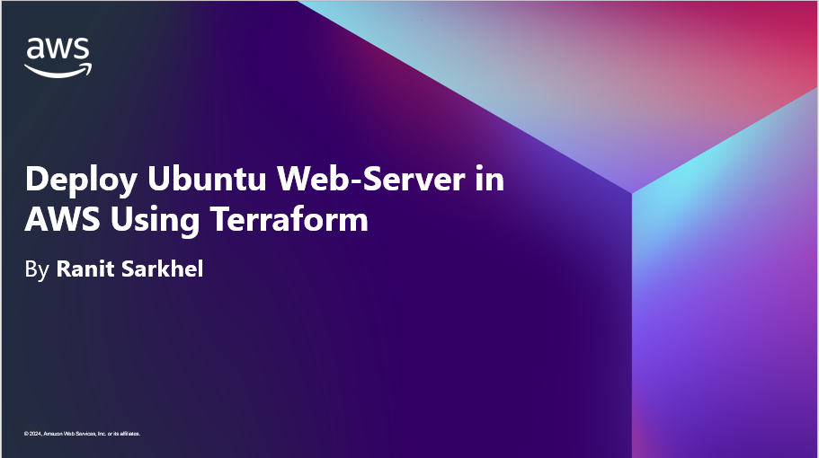
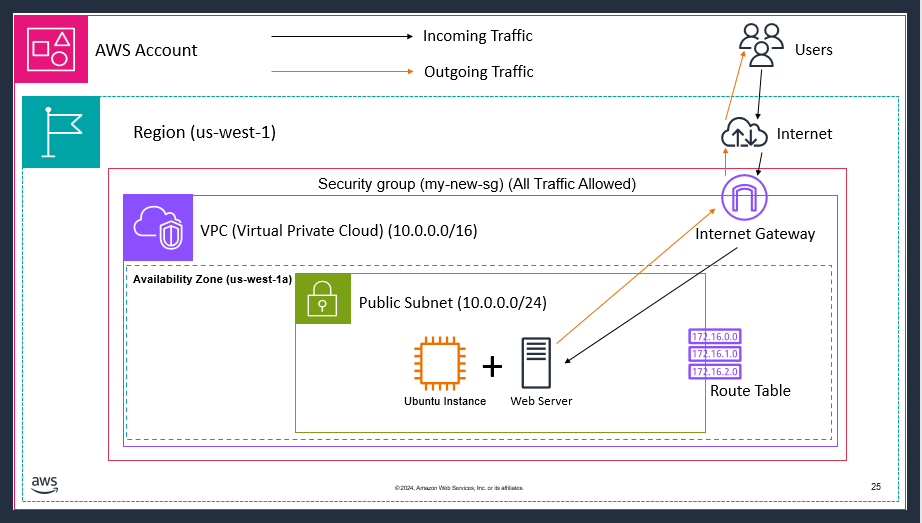

# Creating a Simple ubuntu web server in AWS using Terraform

### Download and install the terraform executable
## 🪟 For Windows :
Go to `https://developer.hashicorp.com/terraform/install` and install the amd64 version. A zip folder will be downloaded. Extract the zip folder then your terraform executable is ready.

## 🐧 For Linux/macOs :
Go to `https://developer.hashicorp.com/terraform/install` then just copy and paste the given commands according to your OS.

## We need to create the following resources to setup the web server : 
1. **Create a VPC**
2. **Create a Subnet**
3. **Create an Internet Gateway**
4. **Create a Custom Route Table**
5. **Associate Subnet with Route Table**
6. **Create a Security Group to Allow All Traffic**
7. **Create a Key-Pair and a Ubuntu EC2 Instance then Install/Update apache2 in it**
8. **copy the public ip from the instance, paste it to your browser. If a web page pops up means configuration is done**
9. **clean up the lab using `terraform destroy` command**

## 🔥The Final Architecture🔥

## 📝 Note :
Before starting with terraform make sure to run the `terraform init` command in the same folder as your `.tf` file. 

## 💡 Tips for using Terraform :
🌐 Before running the `terraform apply` command always run the `terraform plan` command to see if there are some misconfigurations present within your Infrastructure code you've written in Terraform.

🌐 Use `--auto-approve` at the end of `tarraform apply/destroy` command so that terraform will not prompt for `yes` confirmation everytime.

